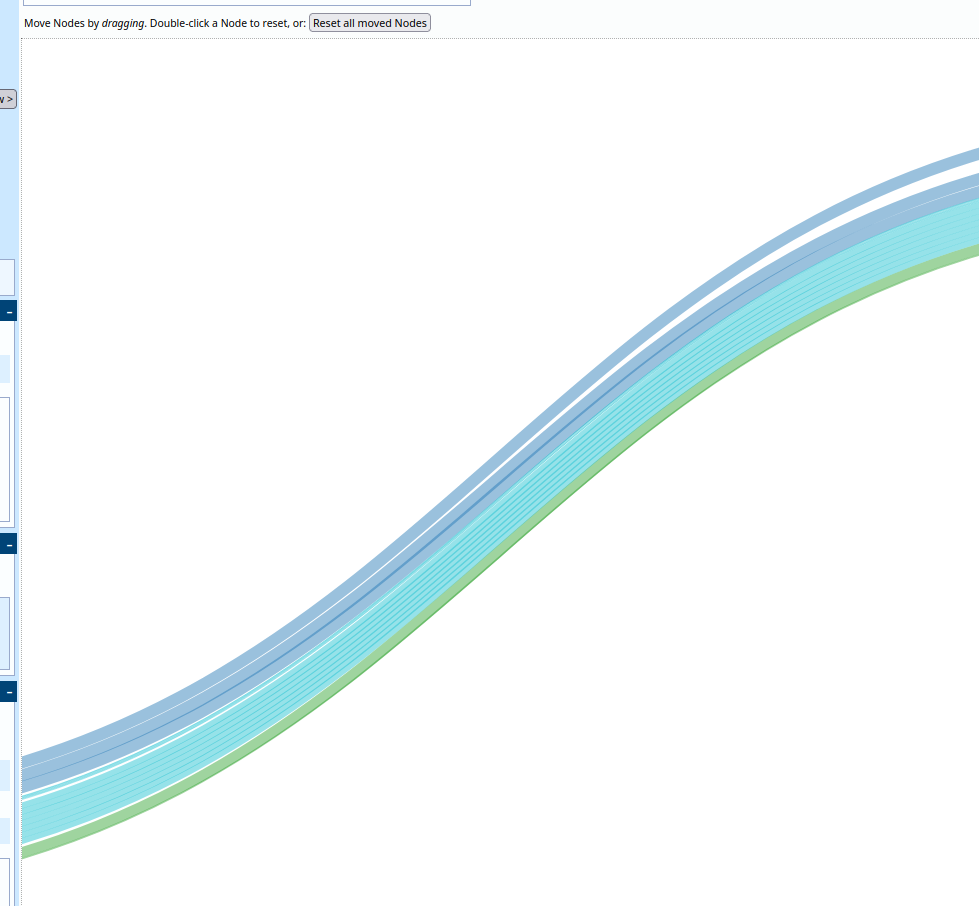

# umsatz-csv-to-sankeymatic

My first rust project.  
Tool to convert a bank csv transaction export to the format needed by https://sankeymatic.com/ to visualize your money flow.

## sankeymatic:
https://www.sankeymatic.com/build/
### example output image

## troubleshooting
when your output image looks like this:  

you have a circle in your ouput data

## csv example data:
[example file](data/transactions.csv)

sparkasse csv export is in latin1 :(

## TODO list:
- clear input buffer before requesting input
- catch ctrl-c in enter labels to redo the regex
- way to skip csv lines in cli prompt
- fix circles
    - in streams capital first letter 
    - out streams small
- is csv header correct if creating new regex_labels.csv
- cli parameters
    - show all = see all entries as final labels
- cli ui
    - HARD: color labels while typing if they exist already to see if they're written correctrly
    - HARD: label autocomplete
    - HARD: regex see what matches?
- generate image automatically
    - is there an api for https://www.sankeymatic.com/build/?
    - download and render local with the sankeymatic js source?
- missing checks:
    - with sankeymatic.com you are not allowed to have circles.
      circle detection is missing 
      circles are quite easyly created with a regex, and a company refunding something!